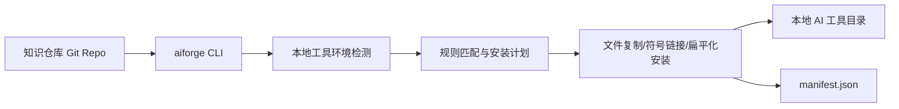

# aiforge - 技术架构

**日期：** 2026-05-25 14:48:20 +0800  
**项目类型：** 单体 CLI  
**架构模式：** 分层 + 流水线 + 数据驱动规则匹配

## 执行摘要

`aiforge` 的核心不是一个复杂算法，而是一条可验证、可扩展、带安全边界的安装流水线。系统先把“知识仓库地址”“认证方式”“本地工具环境”“安装规则”和“目标路径”逐步收口成结构化中间结果，再由安装阶段统一落盘、做冲突保护并记录 manifest。

从实现方式看，它是一个非常典型的 Node.js CLI：

- `index.ts` 负责命令入口与主命令定义
- `pipeline.ts` 负责阶段编排与阶段闭包工厂
- `stages/` 负责业务阶段
- `services/` 负责环境、文件系统与 Git 能力
- `core/` 负责跨层共享的类型、消息、错误与输出
- `data/` 负责规则和注册表

## 系统上下文

## 技术栈

| 维度     | 选型             | 说明                        |
| -------- | ---------------- | --------------------------- |
| 运行时   | Node.js 18+      | CLI 与文件系统操作基础      |
| 语言     | TypeScript       | 强类型契约与跨阶段数据对象  |
| 命令解析 | Commander        | 主命令/子命令/选项解析      |
| 交互     | Inquirer Prompts | `init`、冲突选择、确认流程  |
| Git 能力 | simple-git       | `ls-remote`、clone、pull 等 |
| 输出体验 | Ora + Chalk      | 普通/TTY/quiet 三种输出体验 |
| 构建     | tsup             | 打包 ESM CLI 到 `dist/`     |
| 测试     | Vitest           | 单元、集成、E2E 一体化      |
| 发布     | npm + GitLab CI  | 包分发与质量门禁            |

## 运行时主流程

### 1. 命令入口

`src/index.ts` 定义 `aiforge [repo-url] [options]` 主命令和 `aiforge init` 子命令。主命令流程包括：

1. 解析 Commander 参数并映射成 `ParsedArgs`
2. 预加载配置文件语言设置
3. 创建 Reporter
4. 创建生产阶段闭包 `createProductionStages()`
5. 执行 `runPipeline()`

### 2. 流水线编排

`src/pipeline.ts` 定义了标准阶段序列：

1. `resolve`
2. `authenticate`
3. `clone`
4. `detect`
5. `match`
6. `install`
7. `saveManifest`
8. `report`

关键变体：

- `--dry-run` 会跳过真实安装和 manifest 持久化，只输出计划。
- `--list` 在 clone 后走分叉路径，不进入 detect/match/install。
- `init` 完全不走该流水线，而是单独交互。

### 3. 安装执行

`src/stages/execute-install.ts` 是业务最重的阶段，负责：

- preflight 预检查
- 规则类型分发（`Files` / `Directories` / `Flatten`）
- 安装方式分发（`copy` / `symlink`）
- 冲突检测与交互决策
- 目录创建与文件写入
- 安装状态归类（`new` / `updated` / `skipped`）
- MCP 手工合并提示
- 断链检查与零结果诊断

## 模块分层

## 核心层 `src/core/`

负责跨层共享能力：

- `types.ts`：阶段输入/输出契约、规则模型、manifest 配置结构
- `errors.ts`：统一 `AiforgeError` 与退出码
- `messages.ts`：双语消息表与 `msg()` 访问
- `reporter.ts`：普通输出、TTY 输出、quiet 输出
- `path-resolver.ts`：用户目录与配置目录解析
- `sanitize.ts`：Token/URL/错误消息脱敏

这一层决定了系统如何“表达事实”，而不是如何“安装文件”。

## 数据层 `src/data/`

负责把工具支持和安装策略数据化：

- `tool-registry.ts`：11 个工具的检测定义
- `install-rules.ts`：55 条内置工具规则 + 4 条通用目录规则
- `excludes.ts`：默认排除文件
- `messages.ts`：旧路径兼容导出

这是最重要的扩展点之一。新增工具通常先改这里，再补测试和文档。

## 服务层 `src/services/`

为阶段层提供环境与系统能力：

- `config.ts`：`~/.aiforge/config.json` 的读写与校验
- `git.ts`：Git URL 解析与 simple-git 工厂
- `fs-utils.ts`：复制、symlink、hash、preflight、安全校验
- `manifest.ts`：安装状态追踪与冲突类型识别
- `version-check.ts`：Gemini CLI 最低版本检查

服务层的重点不是抽象复杂度，而是把 I/O 风险、权限风险和安全风险显式收口。

## 阶段层 `src/stages/`

每个阶段完成一个可以单测的业务动作：

- `resolve-source.ts`：解析 CLI/source/config 的知识源地址
- `authenticate.ts`：按优先级链决定认证方式
- `clone.ts`：clone 或增量 pull，并清理含 token 的 remote URL
- `detect-tools.ts`：自动检测工具或校验手工指定工具
- `match-rules.ts`：根据工具、scope、dirs、filter 生成安装计划
- `list-contents.ts`：支持 `--list`
- `execute-install.ts`：真实安装
- `conflict-resolver.ts`：交互式冲突决策
- `filter-utils.ts`：filter pattern 解析与 glob 匹配
- `semantic-warnings.ts`：安装前语义风险确认

## 命令层 `src/commands/`

当前主要是 `init.ts`：

- 检查 TTY
- 读取现有配置
- 选择语言
- 输入默认仓库 URL
- 选择认证方式并验证连接
- 选择通用目录偏好
- 保存 `config.json`

它是一个独立的交互式配置向导，不依赖主安装流水线。

## 关键数据契约

主要对象沿着流水线逐步演化：

- `ParsedArgs`
- `ResolvedSource`
- `AuthenticatedSource`
- `LocalRepo`
- `DetectedEnv`
- `MatchedPlan`
- `InstallResult`
- `ManifestEntry`
- `AiforgeConfig`

这种“阶段产物显式建模”的方式是代码可读性较高的主要原因之一。每个阶段都拿到一个更具体、更窄的对象，而不是共享一个不断膨胀的上下文包。

## 扩展模型

### 工具扩展

新增工具支持的常见落点：

1. `src/data/tool-registry.ts` 增加检测定义
2. `src/data/install-rules.ts` 增加全局/项目级规则
3. 若需要，增加 precondition 或 unsupported notice
4. 补 `tests/data/*`、`tests/stages/*`、`tests/integration/*`
5. 补 `docs/install-rules-matrix*.md`、`README*` 等文档

### 命令扩展

新增子命令需要：

1. 在 `src/commands/` 新增命令模块
2. 在 `src/index.ts` 注册命令
3. 若复用流水线，可复用 `pipeline.ts`
4. 若是独立交互流程，可仿照 `init.ts`

## 安全与一致性边界

系统在多个位置主动限制危险行为：

- **Token 脱敏：** `sanitizeToken()`、`sanitizeUrl()`、`sanitizeMessage()`
- **路径遍历防护：** `validatePathSecurity()`
- **symlink 逃逸防护：** `validateAncestorRealpath()`、`validateDestPathSecurity()`
- **路径类型校验：** 明确拒绝“应为目录却实际是文件”的目标路径
- **冲突分级：** `none` / `aiforge-current` / `aiforge-outdated` / `user-file` / `unknown-origin` / `user-modified`
- **Claude 保留文件保护：** 阻止覆盖工具保留配置文件
- **manifest 损坏降级：** 损坏时仍允许系统以保守方式运行，不直接崩溃

## 测试架构

当前仓库验证基线：

- `npm test` 通过：42 个测试文件、1020 个测试用例
- `npm run build` 通过

测试层次如下：

- **核心单元测试：** `tests/core/`
- **数据与服务测试：** `tests/data/`、`tests/services/`
- **阶段测试：** `tests/stages/`
- **编排与生产闭包测试：** `tests/pipeline.test.ts`、`tests/integration/pipeline*.test.ts`
- **按 Epic 的 E2E：** `tests/integration/epic-1-*.test.ts` 到 `epic-7-*.test.ts`

## 发布与交付架构

系统没有“部署到服务器”的运行时拓扑，交付模型是 npm 包发布：

- `.gitlab-ci.yml` 中 `quality` 阶段运行 `lint -> test -> build -> npm pack --dry-run`
- `publish:npm` 阶段在 tag 条件下手动发布
- `package.json` 的 `prepublishOnly` 再次确保发包前质量门禁
- 最终发布产物包括 `dist/`、`README.zh.md`、`docs/*.md`、`CHANGELOG.md`

## 架构约束与空白

- 没有服务端 API，也没有数据库模型，所以很多传统“后端架构”章节在本项目不适用。
- 仓库中有大量知识内容目录（`.github/skills`、`_bmad-output/`），扫描时必须区分“产品源码”和“样本/规划资产”。
- `docs/configuration*.md` 里提到的 `aiforge update` 与当前 `package.json`/`src/commands/` 实现并不对应，后续如果继续演进命令面，需先核对文档与实现一致性。

---

_Generated using BMAD Method `document-project` workflow_
